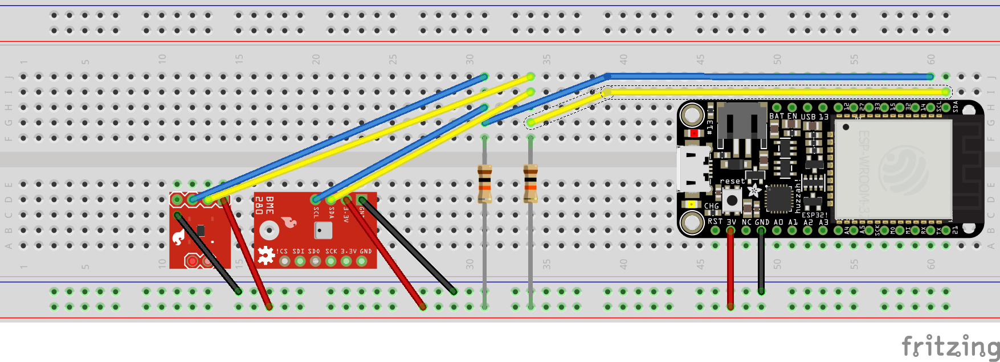

# esp32_bme280_ws

Arduino code for streaming BME280 sensor data from a websocket. Uses soft AP configuration, so doesn't require a router. The output is in a csv or JSON format. 
Most of the code is taken other sources:
[Setting up the ESP32](https://randomnerdtutorials.com/installing-the-esp32-board-in-arduino-ide-windows-instructions/) and [setting it as a soft AP](https://randomnerdtutorials.com/esp32-access-point-ap-web-server/) and [BME280](https://randomnerdtutorials.com/bme280-sensor-arduino-pressure-temperature-humidity/) from Random Nerd Tutorials. I have also included code which allows a second temperature sensor (TMP102) to be added via I2C. I followed the wiring instructions from a [video](https://www.youtube.com/watch?v=nEySekIIxpw) from Garage Geek Guy.


## Requirements
- ESP32 -  I used the HUZZAH32 – ESP32 Feather Board from [Adafruit](https://www.adafruit.com/product/3405)

- BME280 - I used Sparkfun Atmospheric Sensor Breakout - BME280 from [sparkfun](https://www.sparkfun.com/products/13676)

- TMP102 - If you want to include a second sensor, I used the [SparkFun TMP102](https://www.sparkfun.com/products/13314)


## Usage

Wire up as follows:


Install code and libraries described in the links above.

If the you encounter an error using I2C communication protocol for the BME, try switching the address from  0x76 to  0x77 at `status = bme.begin(0x77)`.

To switch to a Json output, remove
```char msg[200];
sprintf(msg, "%f,%f,%f,%f", temperature,pressure,altitude,humidity);
webSocket.sendTXT(0,msg);
```
and uncomment
```
//Using JSON format

//DynamicJsonDocument  doc(200);

//doc["Temperature"] = tempstr;
//  doc["Pressure"] = presstr;
//
//  doc["Pressure"] = altstr;
//
//  doc["Humidity"] = humstr;

//String output;
//serializeJson(doc, output);
//webSocket.sendTXT(0,output);
```

Works well with the python application [socscrollsave](https://github.com/damianjwilliams/socscrollsave), which allows real-time plotting of sensor data and saving data as a csv file.
See my [website](www.ephys.org/ESP32) for examples.

## License
The project is distributed under MIT License
